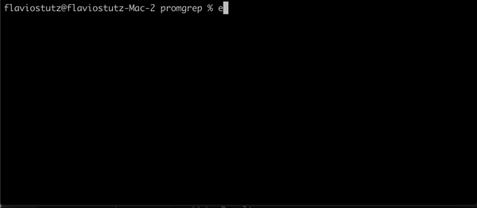

# promgrep
Prometheus exporter for metrics that are gotten from stdin and then parsed with regex rules

## Usage

[Download binary for your platform here](https://github.com/stutzlab/promgrep/releases)

```sh
echo "some thing thing thing here " | promgrep --summary "thing@thing"&
curl http://localhost:8880/metrics | grep promgrep
```

Result:

```sh
# HELP promgrep_thing Counters for regex 'thing'
# TYPE promgrep_thing summary
promgrep_thing_sum 3
promgrep_thing_count 3
```



## Arguments

* "--summary [metric_name]@[regex]" defines regex rules for extracting metrics from input stream and expose it as [Prometheus Counters](https://prometheus.io/docs/concepts/metric_types/#counter). If regex has a group match for a number ([0-9\\.]+), the matched number will be used as the counter incrementer. If not defined, an increment of "1" is used. Summary will create two metrics: a _sum with the total counter and a _count with the number of matches found in stream. If no group match for a number is used in regex, sum will be "0" and only _count will increment.

* "--gauge [metric_name]@[regex]" defines regex rules for extracting metrics from input stream and expose it as [Prometheus Gauges](https://prometheus.io/docs/concepts/metric_types/#gauge). The regex must have a group match for a number ([0-9\\.]+) as it will be used as the value in metrics.


